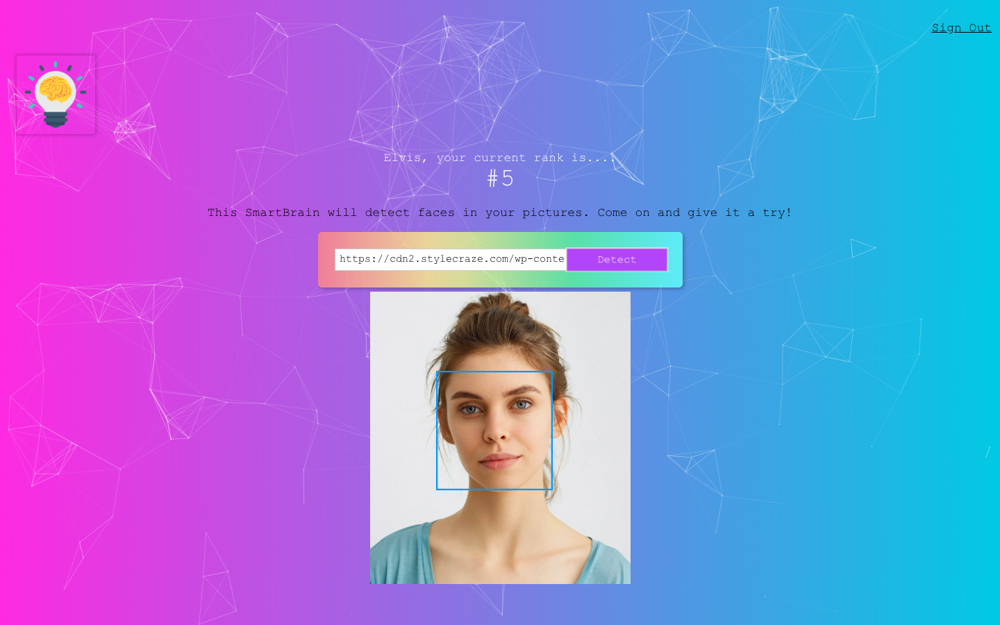

SmartBrain is a face detection game where player can insert a photo and the application will automatically detect number of faces. Player will obtain 1 point for each face detected from the photo he/she inserted and player with most point wins the game.

This application is built with ReactJS and using Clarifai Face Detection API. 

This is just a snapshopt of the application. Currently completed the front-end and will move on to build the backend. Stay tuned :)
